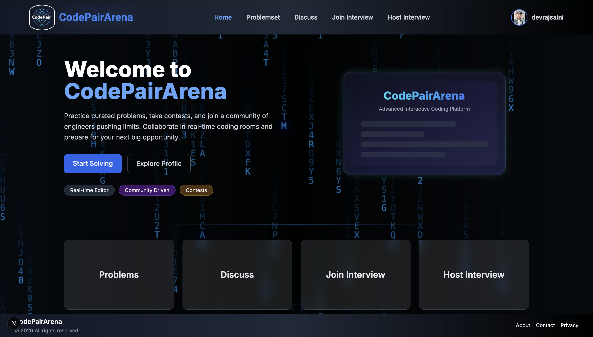
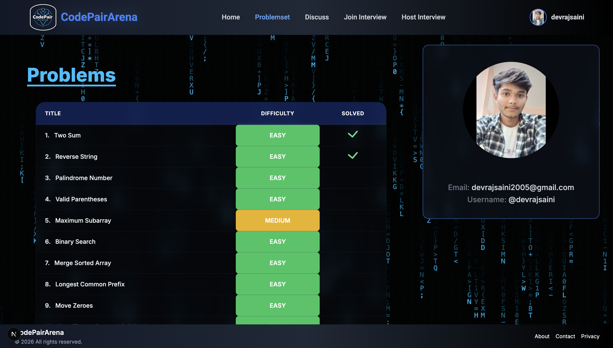
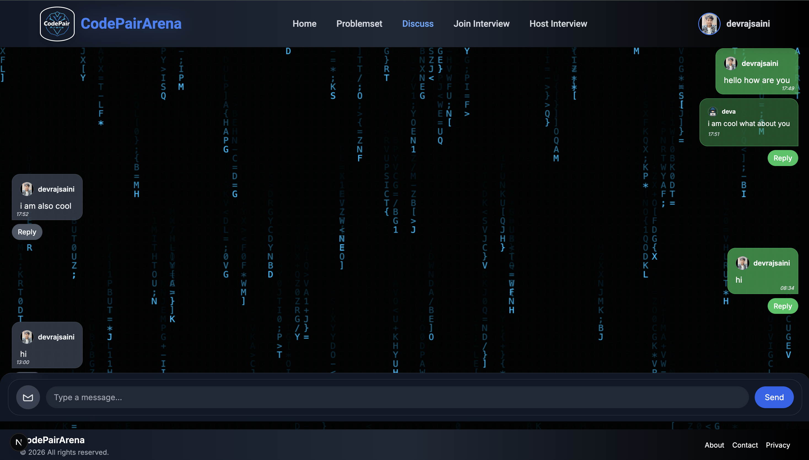
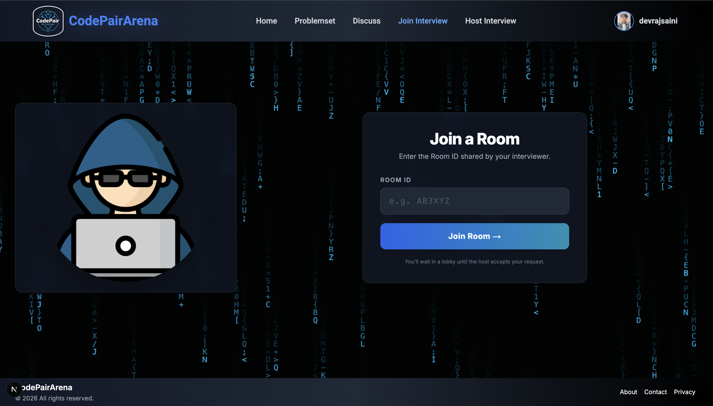
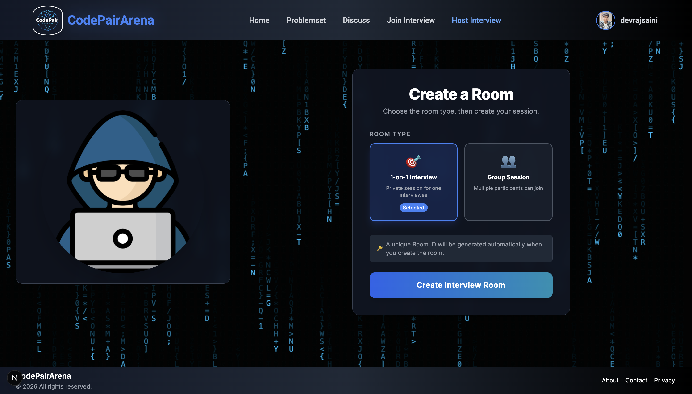
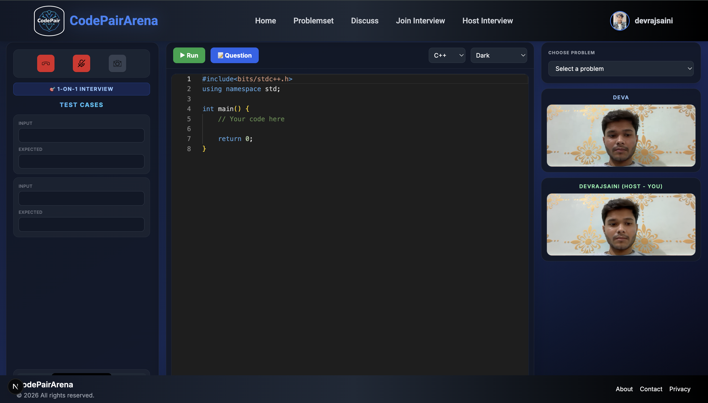
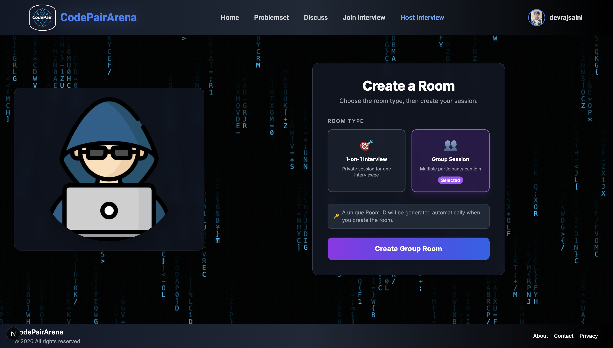
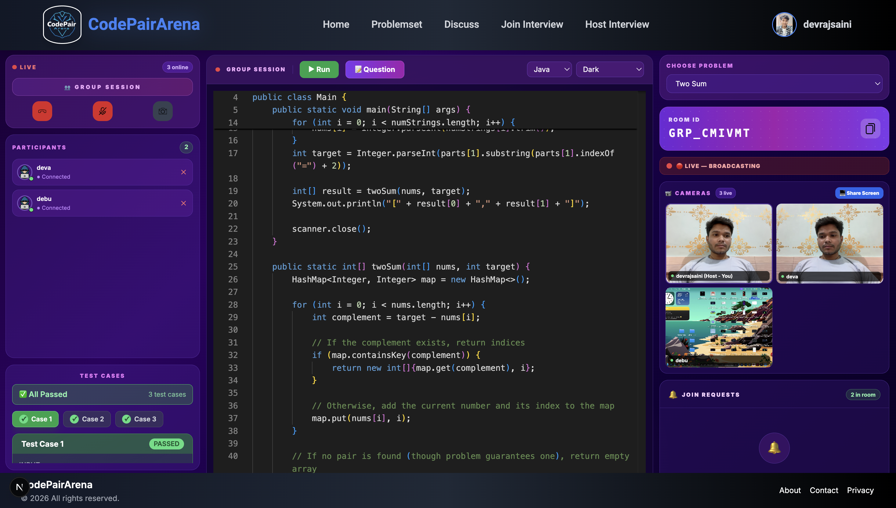
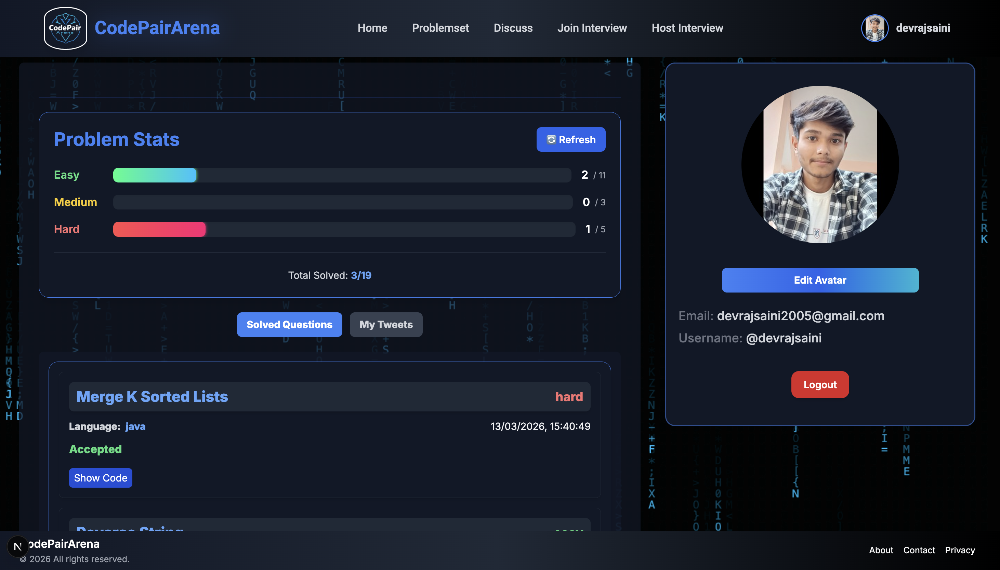

# 🚀 CodePairArena

Welcome to **CodePairArena**! An interactive, real-time collaborative coding platform designed to bring developers together. Whether you're pair programming, conducting technical interviews, or hosting group coding sessions, CodePairArena provides a seamless, immersive environment.



## ✨ Features

- **🧑‍💻 Real-Time Collaborative Editor**: Write and edit code together in real-time with Monaco Editor (the engine that powers VS Code).
- **🎥 Integrated Group Sessions**: Full-mesh WebRTC communication allows multi-party video and audio calls directly within the platform.
- **🖥️ Screen Sharing**: Easily share your screen or application window with other participants.
- **⚡ Fast & Responsive**: Built with Next.js and React for blazing fast performance.
- **🎨 Beautiful UI**: A stunning, animated user interface crafted with Tailwind CSS and Framer Motion.
- **🔄 State Management**: Robust state handling across sessions using Redux Toolkit.
- **🔌 Real-Time Signaling**: Low-latency event broadcasting and real-time syncing using Socket.io.

## 🛠️ Tech Stack

- **Frontend Framework**: [Next.js](https://nextjs.org/) (React 18)
- **Styling**: [Tailwind CSS](https://tailwindcss.com/)
- **Code Editor**: [@monaco-editor/react](https://github.com/suren-atoyan/monaco-react)
- **Real-Time Communication**: [Socket.io Client](https://socket.io/) & WebRTC
- **State Management**: [Redux Toolkit](https://redux-toolkit.js.org/)
- **Animations**: [Framer Motion](https://www.framer.com/motion/)
- **Icons**: [Lucide React](https://lucide.dev/) & [React Icons](https://react-icons.github.io/react-icons/)

## 🚀 Getting Started

First, ensure you have the backend (Socket.io/WebRTC signaling server) running. Then, to start the frontend development server:

```bash
npm run dev
# or
yarn dev
# or
pnpm dev
# or
bun dev
```

Open [http://localhost:3000](http://localhost:3000) with your browser to see the result.

## 📸 Screenshots

Here is a glimpse of what CodePairArena looks like:

### Application Interface




### Group Sessions & Collaboration




### Real-Time Features





